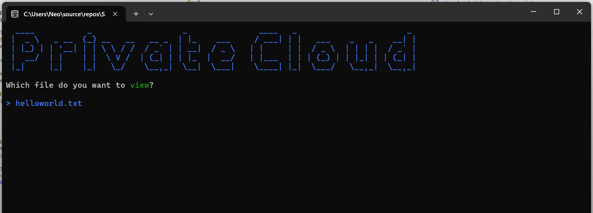

# Lernperiode-9
Containerised private fileserver using  ASP.NET and MongoDB as the Backend, and a Spectre.Console Frontend

## Zusammenfassung

Heute habe ich eine ASP.NET-API entwickelt, die Dateien in MongoDB über GridFS speichert und per GET abrufbar macht. Der Schwerpunkt liegt auf der Trennung von Metadaten und den eigentlichen Dateiinhalten innerhalb einer virtuellen Verzeichnisstruktur. Die Benutzeroberfläche erfolgt über ein Kommandozeilen-Interface (CLI), implementiert in C# unter Verwendung der Bibliothek Spectre.Console. Das gesamte System ist containerisiert mit Docker, um eine einfache Portierbarkeit und konsistente Laufzeitumgebungen zwischen Entwicklungs- und Zielsystemen zu gewährleisten. Auch habe ich zum erstes Mal mehrere Projekte im gleches Solution verwendet, und da ich mein Client auch ausversehen Containerized hatte (VS macht das automatisch) kam es zu Port konflikte. Ich habe auch gelernt, wie Containers zu debuggen in VS.

## Aktueller Projektstatus: Infrastruktur-Setup (20.02.2026)

Heute wurde das Grundgerüst der Anwendung erstellt und die Kommunikation zwischen den einzelnen Komponenten vorbereitet.

-   **Lösungsarchitektur:** Erstellung der Multi-Projekt-Struktur bestehend aus Cloud.Api und Cloud.Client.
    
-   **Containerisierung:** Konfiguration von Dockerfile und Docker Compose zur Orchestrierung von API und Datenbank.
    
-   **Datenbankschicht:** Integration des MongoDB-Treibers und Initialisierung der GridFS-Buckets für die Datenspeicherung.
    
-   **CLI-Frontend:** Grundgerüst der Spectre.Console-Anwendung zur interaktiven Darstellung der Dateilisten.

## Client UI

----------

## Arbeitspakete 27.02.2026

Beschreibung: Implementierung einer Sicherheitsinstanz zur Identifizierung von Benutzern.  
Ziel: Nur autorisierte Benutzer können auf die API zugreifen; die Grundlage für private Datenbereiche ist geschaffen.  
- [x] Integration von JWT (JSON Web Tokens)  
- [x] Erstellung eines User-Modells und einer Anmelde-Logik  
- [x] Vorbereitung der Datenbank-Metadaten auf ein Pflichtfeld `OwnerId`  
- [x] Password hashing  

Heute habe ich die Arbeitspakete implementiert, BCrpyt für das Hashing, IdentityModel.Tokens für das JWT und die FileEntryDto (mit OwnerId natürlich) implementiert. Ich habe mit Postman Teilen meiner API getestet, und sie haben "einigermassen funktioniert" (es gab ein paar Fehler im Logik, die aber einfacher zu beheben sind.) Ich habe auch gelernt wie meine Endpoints zu mappen, da es eine Minimale-API ist macht mann das anders als bei Controllers. Das war nicht so einfach, ich müsste sehr viel debuggen, und lernen wie genau aspnet funktioniert. (meistens lässt mann die builder Sachen eher in Ruhe) Da der Backend trotz das es ohne Fehler compiled und lauft immer 404 gab, müsste ich die Häckchen oben wegnehmen weil es jetzt immer noch nicht funktional ist. Damit es nächstes Mal weniger Chance auf Bugs gibt und ich schneller debiggen kann, habe ich die Endpoints in TestEndpoints, AuthEndpoints und FileEndpoints aufgeteilt. 

## Arbeitspakete 06.03.2026

Beschreibung: Hochperformante Verarbeitung von Dateitransfers und grundlegende CRUD-Operationen.  
Ziel: Dateien jeder Größe können stabil zwischen Client und Server übertragen werden.  
- [ ] Erstellung von Streaming-Endpunkten für Upload (POST) und Download (GET)  
- [x] Nutzung von GridFS-Streams zur RAM-Schonung  
- [ ] Implementierung von Endpunkten zum Löschen von Dateien  
- [ ] Implementierung von Endpunkten zum Umbenennen von Dateien

Heute habe ich mir viele Gedanken über die Architektur gemacht. Ich habe heute der Anfang gemacht für Support von registrierte Backends und ihre clients. Das problem damit war, dass nicht jede Client sich als user einloggen sollte. Jetzt ist das Plan, dass man ein Service registrieren kann, welches ein permanentes Key bekommt. Wenn ein client dieses registrierte backend für resources fragt, schickt diese die Anfrage weiter zum fileserver, und generieret es ein temporäres JWT mit fileId und expiry time Claims. So kann der Client direkt auf dem Fileserver zugreifen und nur die Dateien holen, die im temporäres JWT spezifiziert sind. Ich habe mehrere Klassen und ein Teil der Logik dazu implementiert. Auch habe ich streaming Endpunkte für alle Dateien und Dateien mit Pfad gemacht, und mit ID. Es gibt ein neues Patch Endpunkt damit man die Zugriffsrechte auf eine Datei ändern kann.

## Arbeitspakete 13.03.2026

Beschreibung: Abstraktion der flachen Dateiliste in eine hierarchische Ordnerstruktur.  
Ziel: Der Benutzer kann die Cloud wie ein klassisches Dateisystem bedienen.  
- [ ] Erweiterung der Metadaten um ein `Path`-Attribut  
- [ ] Anpassung der API-Abfragen zur Filterung nach Verzeichnissen  
- [ ] Implementierung einer Navigationslogik im CLI

Heute was fast ausschliesslich debugging, es gab ein Problem mit dem JWT, gemäss Docker logs war der Token ok, aber gemäss die gleichen Logs war er malformed. Ich konnte das Problem nach 2 Stunden nicht finden. Daher habe ich kaum Fortschritt gemacht, und werde ich die auth Teile vom Code neu schreiben.

## Arbeitspakete 20.03.2026

Beschreibung: Vorbereitung des Systems für den Einsatz auf dem Raspberry Pi.  
Ziel: Die Anwendung ist sicher konfiguriert und bereit für das Deployment auf produktiver Hardware.  
- [ ] Auslagerung sensibler Daten in Environment Variables  
- [ ] Optimierung des Docker-Images für ARM-Architekturen  
